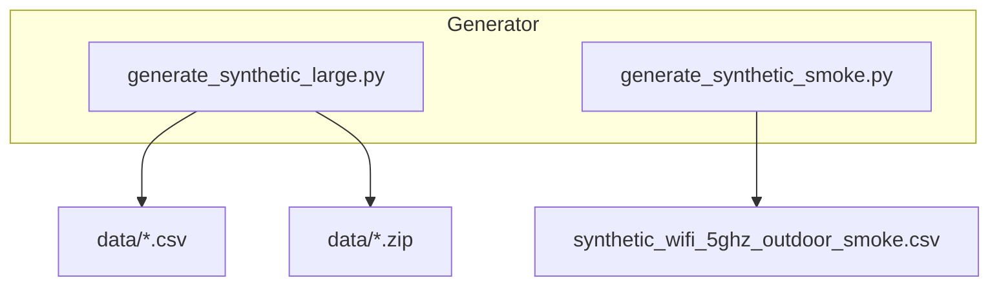
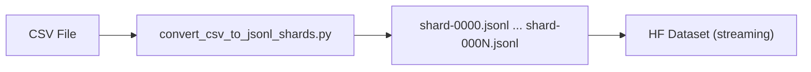
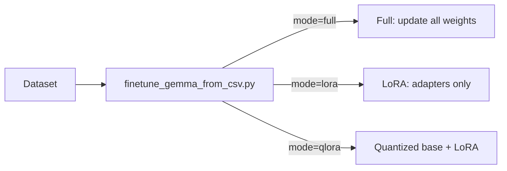
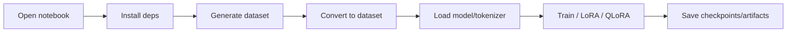

`````markdown
# Model Training Gemma-270M — A-to-Z Tutorial (Beginner-Friendly)

This tutorial walks through the entire project step-by-step. It assumes you can run basic shell commands and have Python installed. Filenames and commands are wrapped in backticks (e.g., `scripts/finetune_gemma_from_csv.py`). Mermaid diagrams are included to visualize workflows.

---

## Table of Contents

| Section | Description |
|---|---|
| 1. Project overview | What and why |
| 2. Quick setup | Local setup (first run) |
| 3. Data generation | Smoke & large datasets |
| 4. Validation & conversion | CSV → JSONL → HF Dataset |
| 5. Training CLI | Full / LoRA / QLoRA |
| 6. Dry-run & checkpoints | Validation & resume |
| 7. Notebooks | Colab usage |
| 8. Tests & CI | Automation |
| 9. Troubleshooting | Common errors |
| 10. Next steps | Experiments |
| 11. FAQ | Beginner Q&A |

---

## 1) Project overview (what and why)

This repo demonstrates an end-to-end flow for:

- generating synthetic wireless link data (CSV),
- converting CSV rows into conversational training examples,
- fine-tuning a compact model (Gemma-270M) with Hugging Face + TRL SFT,
- supporting memory-efficient methods (LoRA and QLoRA),
- providing notebooks and CLI tools for reproducibility.

High-level dataflow:

````mermaid
flowchart LR
  A[Generator (CSV)] --> B[Validator]
  B --> C[Converter (CSV -> JSONL shards)]
  C --> D[HF Dataset (streaming) / local preview]
  D --> E[Training CLI / Notebook]
  E --> F[Checkpoints / Artifacts]
  F --> G[Evaluation]
`````


## 2) Quick setup (local)

| Step                        | Command                               |
| --------------------------- | ------------------------------------- |
| Create venv                 | `python3 -m venv .venv`               |
| Activate venv               | `source .venv/bin/activate`           |
| Install base deps           | `pip install -r requirements.txt`     |
| Install dev deps (optional) | `pip install -r requirements-dev.txt` |

---

## 3) Data generation — smoke & large

There are two generators:

* `scripts/generate_synthetic_smoke.py` — produces a small CSV (≈50 rows) for quick checks.
* `scripts/generate_synthetic_large.py` — streams larger datasets (10k+ rows) with chunked writes and SHA256 integrity.

Generation & storage:



---

## 4) Data validation and conversion

Validator:

```bash
python scripts/validate_dataset.py data/synthetic_wifi_5ghz_10,000.csv
```

Convert to JSONL shards:

```bash
python scripts/convert_csv_to_jsonl_shards.py \
  --csv data/synthetic_wifi_5ghz_10,000.csv \
  --out-dir data/jsonl_shards \
  --shard-size 2500
```

Load shards (HF `datasets` if available, otherwise preview):

```bash
python scripts/load_shards_to_dataset.py --shards-dir data/jsonl_shards
```

Conversion flow:



Schema example (per-line JSONL):

```json
{
  "messages": [
    {"role": "user", "content": "<prompt>"},
    {"role": "assistant", "content": "<target>"}
  ]
}
```

---

## 5) Training options and CLI (`scripts/finetune_gemma_from_csv.py`)

This script:

1. Reads CSV (optionally `--max-rows`).
2. Optionally builds an HF `Dataset` (if `datasets` installed).
3. Loads model and tokenizer (lazy imports).
4. Configures TRL `SFTTrainer`, then trains/saves.

| Flag                                                    | Purpose                               |
| ------------------------------------------------------- | ------------------------------------- |
| `--csv`                                                 | Path to CSV dataset (required)        |
| `--mode`                                                | `full`, `lora`, or `qlora`            |
| `--lora-r`, `--lora-alpha`, `--lora-dropout`            | LoRA hyperparameters                  |
| `--num-epochs`                                          | Number of epochs                      |
| `--per-device-batch-size`                               | Batch size per device                 |
| `--learning-rate`                                       | Learning rate                         |
| `--fp16`, `--bf16`, `--gradient-checkpointing`          | Performance flags                     |
| `--resume-from-checkpoint`                              | Resume path                           |
| `--save-strategy`, `--save-steps`, `--save-total-limit` | Checkpoint control                    |
| `--dry-run`                                             | Build pipeline without heavy training |

Training modes:



LoRA quick smoke:

```bash
python scripts/finetune_gemma_from_csv.py \
  --csv data/synthetic_wifi_5ghz_10,000.csv \
  --mode lora \
  --lora-r 8 \
  --lora-alpha 32 \
  --num-epochs 1 \
  --max-rows 200
```

QLoRA (Colab):

```bash
# In Colab
%pip install bitsandbytes peft
python scripts/finetune_gemma_from_csv.py \
  --csv /content/synthetic_wifi_5ghz_outdoor.csv \
  --mode qlora \
  --num-epochs 2
```

---

## 6) Dry-run, checkpointing and resume

| Flag                       | Purpose                                  |
| -------------------------- | ---------------------------------------- |
| `--dry-run`                | Build dataset + trainer without training |
| `--resume-from-checkpoint` | Continue from checkpoint                 |
| `--save-strategy`          | When to save (steps/epochs)              |
| `--save-steps`             | Interval for saving                      |
| `--save-total-limit`       | Max checkpoints to keep                  |

---

## 7) Notebooks and Colab

Colab-ready notebook:

* `site/en/gemma/docs/core/huggingface_text_full_finetune_with_generator.ipynb`

Notebook flow:



---

## 8) Tests and CI

| Job               | What it does                               |
| ----------------- | ------------------------------------------ |
| `test`            | Runs `pytest` + notebook fixer             |
| `smoke-generator` | Runs `scripts/generate_synthetic_smoke.py` |
| `dry-run-trainer` | Runs training CLI with `--dry-run`         |

---

## 9) Troubleshooting — common errors and quick fixes

| Error                    | Fix                                                                            |
| ------------------------ | ------------------------------------------------------------------------------ |
| `ModuleNotFoundError`    | `pip install -r requirements*.txt`                                             |
| Out-of-memory            | Reduce batch size / rows; use `--mode lora`; enable `--gradient-checkpointing` |
| HF license/access denied | Accept license on HF Hub and `huggingface_hub.login()`                         |

---

## 10) Next steps and recommended experiments

* Add `--stratify-by` option for balanced data
* Deterministic seeds + reproducibility tests
* LoRA vs full fine-tune comparisons
* Evaluation metrics in `scripts/evaluate_model.py` (MAE/RMSE, confusion matrices)

---

## FAQ for beginners

| Question            | Answer                                                                |
| ------------------- | --------------------------------------------------------------------- |
| What is LoRA?       | Low-Rank Adaptation; small trainable adapters on a frozen base model. |
| What is JSONL?      | JSON Lines: one JSON object per line; great for streaming.            |
| Why shard datasets? | Split large data into files to stream without loading all into RAM.   |

```
```
