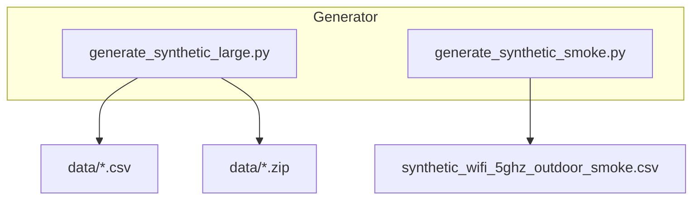
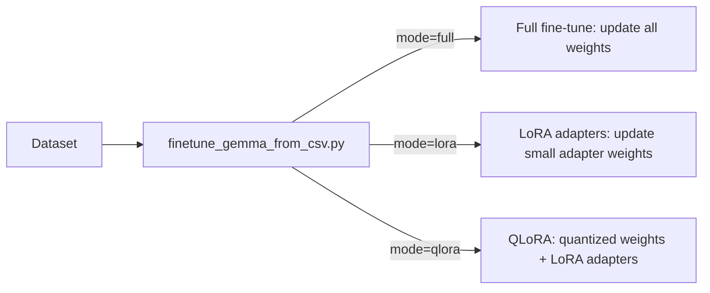

# Model Training Gemma-270M — A to Z Tutorial (Beginner Friendly)

This tutorial explains the entire project step-by-step from a beginner perspective. It assumes you know how to run basic shell commands and have Python installed. Wherever a filename or symbol is mentioned, it's wrapped in backticks (e.g., `scripts/generate_synthetic_smoke.py`). Mermaid diagrams are included to visualize workflows and dataflows.

---

## Table of contents

1. Project overview
2. Quick setup (local / Colab)
3. Data generation (smoke and large)
4. Data validation and conversion (CSV → JSONL shards → HF Dataset)
5. Training options (full, LoRA, QLoRA) and the training CLI
6. Dry-run, checkpointing and resume
7. Notebooks and how to run them in Colab
8. Tests & CI (what runs in CI)
9. Troubleshooting & common errors
10. Next steps and recommended experiments

---

## 1) Project overview (what and why)

This repo demonstrates an end-to-end flow for:

- generating synthetic wireless link data (CSV),
- converting CSV rows into conversational training examples,
- fine-tuning a small model (Gemma-3 270M) using Hugging Face + TRL SFT,
- adding memory-efficient fine-tuning methods (LoRA and QLoRA),
- providing notebooks and CLI tools for reproducibility.

If you're new to machine learning engineering, think of this repo as a reproducible lab: code to produce data, code to validate and prepare it, and code to use that data to teach a model how to make predictions.

High-level architecture (dataflow):

```mermaid
flowchart LR
  A[Generator (CSV)] --> B[Validator]
  B --> C[Converter (CSV -> JSONL shards)]
  C --> D[HF Dataset (streaming) / local preview]
  D --> E[Training CLI / Notebook]
  E --> F[Checkpoints / Artifacts]
  F --> G[Evaluation]
```

This diagram shows the path from synthetic data to results. The converter allows streaming large datasets to avoid running out of memory.

---

## 2) Quick setup (local) — make this work first

Commands below assume a Linux/macOS shell. Replace `python3` with `python` if needed.

1. Create a Python virtual environment and activate it:

```bash
python3 -m venv .venv
source .venv/bin/activate
```

2. Install minimal requirements for smoke testing:

```bash
pip install -r requirements.txt
```

3. (Optional) For development that requires streaming `datasets` install dev requirements:

```bash
pip install -r requirements-dev.txt
```

`requirements-dev.txt` contains `datasets` which allows you to test the streaming Dataset features locally.

---

## 3) Data generation — smoke & large

There are two main data generators:

- `scripts/generate_synthetic_smoke.py` — a tiny generator that creates a small CSV (50 rows by default). Useful for quick checks.
- `scripts/generate_synthetic_large.py` — streaming generator for large datasets (10k+ rows) with chunked writes and SHA256 integrity.

How to run the smoke generator:

```bash
python scripts/generate_synthetic_smoke.py
# Output: ./synthetic_wifi_5ghz_outdoor_smoke.csv and a zip + SHA256
```

How to run the large generator (example):

```bash
python scripts/generate_synthetic_large.py --n-samples 10000 --chunk-size 2000 --out-dir ./data
```

Dataflow diagram for generation and storage:



Each CSV row contains fields like `recommended_channel_mhz` and `expected_throughput_mbps`. The next stage validates ranges and converts rows into conversational prompts/targets.

---

## 4) Data validation and conversion

### Validator

Use `scripts/validate_dataset.py` to check for missing values, value ranges, and throughput sanity. Run:

```bash
python scripts/validate_dataset.py data/synthetic_wifi_5ghz_10,000.csv
```

### Conversion to JSONL shards / Hugging Face Dataset

Large CSVs are converted into JSONL shards by `scripts/convert_csv_to_jsonl_shards.py`. Sharding lets you stream data to HF `datasets` without loading everything into RAM.

Example conversion:

```bash
python scripts/convert_csv_to_jsonl_shards.py --csv data/synthetic_wifi_5ghz_10,000.csv --out-dir data/jsonl_shards --shard-size 2500
```

The loader `scripts/load_shards_to_dataset.py` will attempt to use `datasets.load_dataset` and will fall back to a simple preview if `datasets` is not installed.

Dataflow diagram (conversion):

```mermaid
flowchart LR
  CSV --> Converter[convert_csv_to_jsonl_shards.py]
  Converter --> Shards[shard-0000.jsonl ... shard-000N.jsonl]
  Shards --> Dataset[HF Dataset (streaming)]
```

Each JSONL entry is a dict like `{"messages": [{"role": "user", "content": "<prompt>"}, {"role": "assistant", "content": "<target>"}]}` — this is the conversational format used by Gemma.

---

## 5) Training options and CLI (`scripts/finetune_gemma_from_csv.py`)

This script is the main training entrypoint. It performs these steps:

1. Read CSV (or limited `--max-rows`) and build prompt/target pairs.
2. Optionally use `datasets` to create a HF `Dataset` (if installed).
3. Load the model and tokenizer (lazy import to avoid heavy deps for quick checks).
4. Configure TRL's `SFTTrainer` and train/save.

CLI highlights (use `--help` to see all options):

- `--csv` (required) — path to CSV dataset
- `--mode` — `full` (default), `lora`, `qlora`
- `--lora-r`, `--lora-alpha`, `--lora-dropout` — LoRA hyperparams
- `--num-epochs`, `--per-device-batch-size`, `--learning-rate` — training hyperparams
- `--fp16`, `--bf16`, `--gradient-checkpointing` — resource flags
- `--resume-from-checkpoint`, `--save-strategy`, `--save-steps`, `--save-total-limit` — checkpointing
- `--dry-run` — prepare datasets and skip heavy imports/training (useful for CI)

Mermaid diagram: training modes



Notes on LoRA vs QLoRA:

- LoRA: attaches small adapter matrices to a frozen base model; memory- and compute-efficient for small experiments.
- QLoRA: quantizes weights (e.g., 4-bit) + LoRA; allows fitting larger models in memory but needs `bitsandbytes` and a compatible runtime (usually Colab/GPU).

Example LoRA quick smoke (local or Colab):

```bash
python scripts/finetune_gemma_from_csv.py --csv data/synthetic_wifi_5ghz_10,000.csv --mode lora --lora-r 8 --lora-alpha 32 --num-epochs 1 --max-rows 200
```

Example QLoRA (Colab recommended):

```bash
# In Colab
%pip install bitsandbytes peft
python scripts/finetune_gemma_from_csv.py --csv /content/synthetic_wifi_5ghz_outdoor.csv --mode qlora --num-epochs 2
```

---

## 6) Dry-run, checkpointing and resume

- Use `--dry-run` to validate that datasets and trainer construction succeed without downloading models or running heavy training. This is perfect for CI.
- Use `--resume-from-checkpoint` to continue training from a saved checkpoint.
- Checkpointing settings (`--save-strategy`, `--save-steps`, `--save-total-limit`) help keep storage under control.

CI uses a `dry-run-trainer` job that runs `--dry-run --max-rows 10` so the training code path is exercised without long execution.

---

## 7) Notebooks and Colab

The project contains a Colab-ready notebook: `site/en/gemma/docs/core/huggingface_text_full_finetune_with_generator.ipynb`.

How to use it in Colab:

1. Open the Colab link (a badge is present at the top of the notebook).
2. Select `Runtime -> Change runtime type -> GPU`.
3. Run the dependency cell (uncomment pip install if required).
4. Run the dataset generator cell (adjust `N_SAMPLES`).
5. Convert CSV -> dataset cell.
6. Load model/tokenizer and configure SFTTrainer.
7. Run training cell (watch GPU memory) or use LoRA/QLoRA cells for lower memory runs.

Notebook rendering note: the repo includes `scripts/fix_notebook_widgets.py` and a pre-commit hook that strips widget metadata so GitHub can render the notebook.

Simple notebook flow (visual):


---

## 8) Tests and CI

Unit tests:

- `tests/test_conversion.py` checks conversion roundtrip.
- `tests/test_finetune_dryrun.py` runs the training script in `--dry-run` mode to ensure training path is buildable.

CI workflow (`.github/workflows/ci.yml`) includes:

- `test` job: runs `pytest` and the notebook fixer.
- `smoke-generator` job: runs `scripts/generate_synthetic_smoke.py`.
- `dry-run-trainer` job: runs the training CLI with `--dry-run` to validate trainer construction.

PR template includes a CI badge and a checklist to encourage tests and documentation updates before merging.

---

## 9) Troubleshooting & common errors (and quick fixes)

- ModuleNotFoundError: `datasets` or `transformers` simply means you need to `pip install` the dependency. Use `requirements.txt` or `requirements-dev.txt` for dev features.
- OOM when training:
  - Reduce `--per-device-batch-size`.
  - Reduce `--max-length` or `--max-rows` to smaller samples for smoke tests.
  - Use `--mode lora` to reduce memory usage.
  - Enable `--gradient-checkpointing` if supported.
- HF model license/access denied: ensure you accepted the model license on Hugging Face and logged in via `huggingface_hub.login()`.

---

## 10) Next steps and recommended experiments

- Implement stratified sampling (`--stratify-by`) in `generate_synthetic_large.py` to control class balance.
- Add deterministic generator seeds and tests to assert reproducibility.
- Run controlled LoRA vs full-finetune experiments and record learning curves.
- Add evaluation metrics and visualizations (MAE/RMSE, confusion matrices) under `scripts/evaluate_model.py`.

---

## FAQ for beginners

Q: "What is LoRA?" — LoRA stands for "Low-Rank Adaptation." It attaches a small trainable module to existing weights so you update far fewer parameters. This makes training faster and uses less GPU memory.

Q: "What is JSONL?" — JSON Lines (JSONL) is a file format where each line is a JSON object. It's convenient for streaming large datasets because you can read one entry per line.

Q: "Why shard datasets?" — Sharding splits a large dataset into multiple files so you don't need to load everything into memory at once.

---

If you want, I can also:

- Add step-by-step screenshots or a short annotated notebook demonstrating a LoRA run in Colab.
- Create a `HOWTO_LORA.md` that goes deeper into best LoRA hyperparameters for this dataset.

If you'd like me to commit additional tutorial assets or a condensed quickstart, tell me which one to add next.
