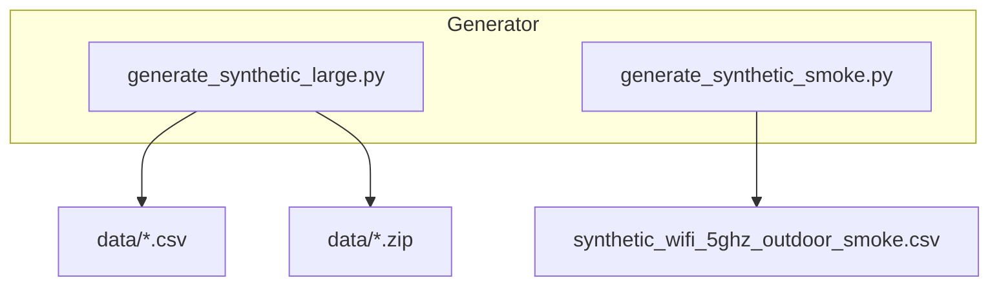
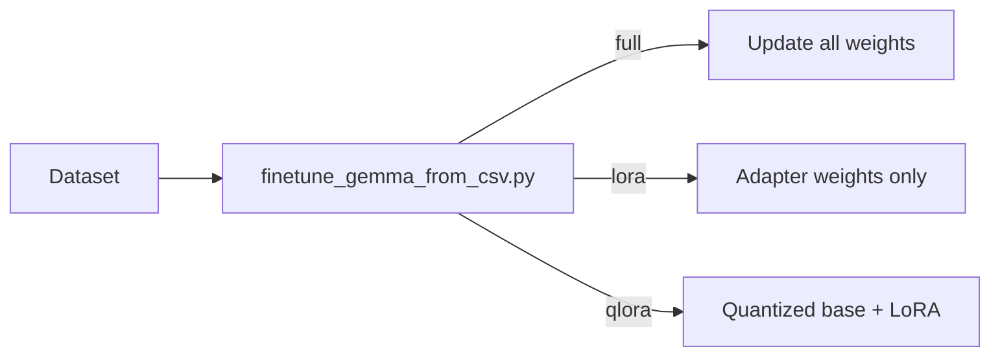
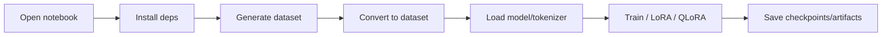

Got it ✅ — here’s your tutorial rewritten in **Markdown format**, but with the **tables expressed in Mermaid `table` syntax** instead of raw Markdown tables. This way everything (TOC, diagrams, tables) stays consistent with your Mermaid-first style.

---

````markdown
# Model Training Gemma-270M — A-to-Z Tutorial (Beginner-Friendly)

This tutorial walks through the entire project step-by-step. It assumes you can run basic shell commands and have Python installed. Filenames and commands are wrapped in backticks (e.g., `scripts/finetune_gemma_from_csv.py`). Mermaid diagrams are included to visualize workflows and tables.

---

## Table of Contents

```mermaid
table
  title "Tutorial Sections"
  header Section, Description
  row "1. Project overview", "What and why"
  row "2. Quick setup", "Local setup (first run)"
  row "3. Data generation", "Smoke & large datasets"
  row "4. Validation & conversion", "CSV → JSONL → HF Dataset"
  row "5. Training CLI", "Full / LoRA / QLoRA"
  row "6. Dry-run & checkpoints", "Validation & resume"
  row "7. Notebooks", "Colab usage"
  row "8. Tests & CI", "Automation"
  row "9. Troubleshooting", "Common errors"
  row "10. Next steps", "Experiments"
  row "11. FAQ", "Beginner Q&A"
````

---

## 1) Project overview (what and why)

This repo demonstrates an end-to-end flow for:

* generating synthetic wireless link data (CSV),
* converting CSV rows into conversational training examples,
* fine-tuning a compact model (Gemma-270M) with Hugging Face + TRL SFT,
* supporting memory-efficient methods (LoRA and QLoRA),
* providing notebooks and CLI tools for reproducibility.

Think of this as a reproducible lab: code to **produce data**, **validate & prepare it**, and **teach a model** using that data.

High-level dataflow:

```mermaid
flowchart LR
  A[Generator (CSV)] --> B[Validator]
  B --> C[Converter (CSV -> JSONL shards)]
  C --> D[HF Dataset (streaming) / local preview]
  D --> E[Training CLI / Notebook]
  E --> F[Checkpoints / Artifacts]
  F --> G[Evaluation]
```

---

## 2) Quick setup (local)

```mermaid
table
  title "Setup Commands"
  header Step, Command
  row "Create venv", "python3 -m venv .venv"
  row "Activate venv", "source .venv/bin/activate"
  row "Install base deps", "pip install -r requirements.txt"
  row "Install dev deps (optional)", "pip install -r requirements-dev.txt"
```

---

## 3) Data generation — smoke & large

Two generators:

* `scripts/generate_synthetic_smoke.py` → ≈50 rows CSV for smoke tests
* `scripts/generate_synthetic_large.py` → 10k+ rows, streaming + SHA256

Generation dataflow:



---

## 4) Data validation and conversion

Validator:

```bash
python scripts/validate_dataset.py data/synthetic_wifi_5ghz_10,000.csv
```

Conversion:

```bash
python scripts/convert_csv_to_jsonl_shards.py \
  --csv data/synthetic_wifi_5ghz_10,000.csv \
  --out-dir data/jsonl_shards \
  --shard-size 2500
```

Conversion flow:

```mermaid
flowchart LR
  CSV --> Conv[convert_csv_to_jsonl_shards.py]
  Conv --> Shards[shard-0000.jsonl ... shard-000N.jsonl]
  Shards --> DS[HF Dataset (streaming)]
```

---

## 5) Training options and CLI

Main script: `scripts/finetune_gemma_from_csv.py`

```mermaid
table
  title "Key CLI Options"
  header Flag, Purpose
  row "--csv", "Path to CSV dataset"
  row "--mode", "Training mode: full / lora / qlora"
  row "--lora-r / --lora-alpha / --lora-dropout", "LoRA hyperparameters"
  row "--num-epochs", "Number of epochs"
  row "--per-device-batch-size", "Batch size per device"
  row "--learning-rate", "Learning rate"
  row "--resume-from-checkpoint", "Resume from checkpoint path"
  row "--dry-run", "Run validation without heavy training"
```

Training modes:



---

## 6) Dry-run, checkpointing, resume

```mermaid
table
  title "Checkpoint Flags"
  header Flag, Purpose
  row "--dry-run", "Build dataset + trainer without training"
  row "--resume-from-checkpoint", "Continue from checkpoint"
  row "--save-strategy", "When to save (steps/epochs)"
  row "--save-steps", "Interval for saving"
  row "--save-total-limit", "Max checkpoints to keep"
```

---

## 7) Notebooks and Colab

Simple notebook flow:



---

## 8) Tests and CI

```mermaid
table
  title "CI Jobs"
  header Job, What it does
  row "test", "Runs pytest + notebook fixer"
  row "smoke-generator", "Runs generate_synthetic_smoke.py"
  row "dry-run-trainer", "Runs finetune CLI with --dry-run"
```

---

## 9) Troubleshooting

```mermaid
table
  title "Common Issues"
  header Error, Fix
  row "ModuleNotFoundError", "pip install -r requirements*.txt"
  row "Out-of-memory", "Reduce batch size / rows / use LoRA"
  row "HF license denied", "Accept license + login to Hugging Face"
```

---

## 10) Next steps

* Add `--stratify-by` option for balanced data
* Deterministic seeds + reproducibility tests
* LoRA vs full fine-tune comparisons
* Evaluation metrics in `scripts/evaluate_model.py`

---

## FAQ

```mermaid
table
  title "Beginner FAQs"
  header Question, Answer
  row "What is LoRA?", "Low-Rank Adaptation, adds small adapters to frozen weights"
  row "What is JSONL?", "JSON Lines: one JSON object per line, great for streaming"
  row "Why shard datasets?", "Splits large data into files to stream without OOM"
```

```

---

Would you like me to **add diagrams for the smoke vs large dataset pipeline as Mermaid `table`s** (with row counts, file names, output artifacts) so the docs show both the **dataflow** *and* the **artifact table** side by side?
```
